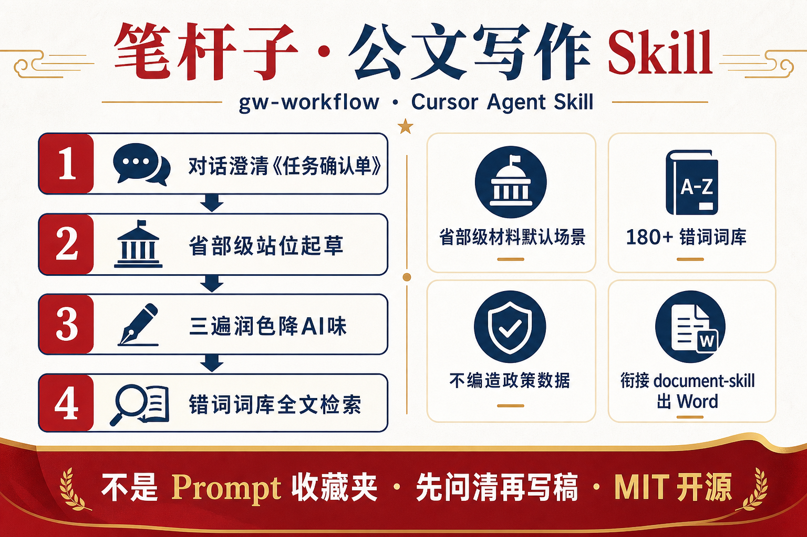
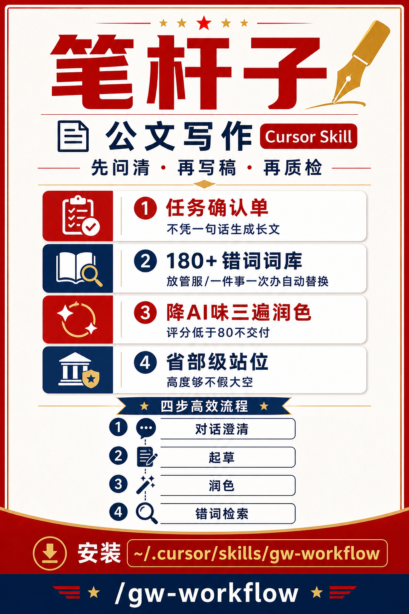

# 笔杆子 · 公文写作 Skill

<p align="center">
  
</p>

<p align="center">
  <strong>gw-workflow</strong> — 面向材料狗的专属公文 Agent Skill<br>
  不是 Prompt 收藏夹，是<strong>先问清、再写稿、再质检</strong>的完整工作流
</p>

<p align="center">
  
  
  
  
</p>

---

## 30 秒了解

| | |
| --- | --- |
| **给谁用** | 写汇报材料、讲话稿、调研报告、工作方案的「笔杆子」 |
| **解决什么** | AI 写公文容易假大空、踩敏感词、像 ChatGPT |
| **怎么不同** | 先出《任务确认单》再动笔；内置 180+ 错词替换；三遍润色 + 评分质检 |
| **默认场景** | 省部级机关材料（省/部随任务而定，文种看场景） |

---

## 核心工作流

```
你提需求 → 对话澄清 → 《任务确认单》 → 确认
    → 按文种起草 → 降 AI 味润色 → 错词词库检索 → 评分 ≥80 交付
    → （可选）document-skill 输出 Word
```

| 步骤 | 做什么 | 为什么 |
| ---: | --- | --- |
| 0 | 识别起草 / 润色 / 局部改写 | 不同任务不同问法 |
| 1 | 加载错词词库 + 敏感词纪律 | 定稿前强制合规 |
| 2 | 三阶段问诊 →《任务确认单》 | 避免一句话生成长文 |
| 3 | 只从背景材料提取事实 | **不编造**文件、领导、数据 |
| 4 | 按文种结构起草 + 省部级站位 | 高度够，不假大空 |
| 5 | 三遍润色 + humanizer | 降 AI 味 |
| 6 | 全文错词检索，附《修改说明》 | 润色可追溯 |
| 7 | 需要 `.docx` 时调 document-skill | 内容与排版分工 |

---

## 亮点功能

### 1. 先问清，再写稿

新建复杂稿件不会直接开写。Agent 会先问：场合、对象、层级、要点、篇幅、背景材料，汇总为《任务确认单》等你确认。

### 2. 180+ 条错词词库

内置 [`错词词库-20260708.csv`](错词词库-20260708.csv)，错词 → 建议词，支持通配符（`*` / `?`）。

覆盖：公平竞争表述、过时政策品牌、党史党建规范、涉台涉疆、形式主义减负、口语化用语等。

> 重点禁用示例：`放管服` · `一件事一次办` · `市场主体`（非文件原文引用时）

### 3. 降 AI 味 + 评分质检

空泛口号、机械排比、万能结尾会被改写；满分 100，**低于 80 不交付**，优先补事实密度与敏感词合规。

### 4. 与 document-skill 分工

| gw-workflow | document-skill |
| --- | --- |
| 对话澄清、站位、错词、正文 | Word / docx 排版 |
| 输出 Markdown 或纯文本 | 用户要 docx 时再调用 |

---

## 快速开始

### 安装（Cursor 个人 Skill）

```bash
git clone https://github.com/YUKEE-spec/gw-workflow.git ~/.cursor/skills/gw-workflow
```

重启 Cursor 或新开 Agent 对话即可生效。

### 调用

```
/gw-workflow
```

或 `@gw-workflow`，示例：

```text
/gw-workflow 起草一份向省委常委会汇报的 XX 工作材料，背景材料如下：……
```

```text
/gw-workflow 润色下面这段，注意错词词库和降 AI 味：……
```

---

## 适用文种

汇报材料 · 讲话稿 · 调研报告 · 工作方案 · 通知 · 请示 · 局部润色

文种不预设，由对话澄清确定；各文种有专属问诊清单（见 `reference-intake.md`）。

---

## 文件结构

```
gw-workflow/
├── assets/
│   ├── gw-workflow-infographic.png   # GitHub 横版信息图（16:9）
│   └── gw-workflow-xiaohongshu.png   # 小红书竖版海报（9:16）
├── SKILL.md                          # Agent 首读（核心流程）
├── 错词词库-20260708.csv             # 错词→建议词主表（可替换更新）
├── reference-intake.md               # 对话澄清、文种问诊
├── reference-sensitive.md            # 敏感词与引用纪律
├── reference-templates.md            # 文种结构与格式
├── reference-style.md                # 降 AI 味、评分、检查清单
├── examples.md                       # 省部级示例
├── tests.md                          # 回归测试用例
└── LICENSE
```

---

## 版本

| 版本 | 说明 |
| --- | --- |
| **v2.3** | 接入用户错词词库（180+ 条） |
| v2.2 | 更名为 `gw-workflow`（笔杆子 · 公文工作流） |
| v2.1 | 拆分 reference；文种问诊；敏感词独立 |
| v2.0 | 对话澄清、站位、敏感词 |
| v1.0 | 上游 [official-document-skill](https://github.com/Liuxiangjian-ai/official-document-skill) |

---

## 致谢 Acknowledgments

本 Skill 在 [Liuxiangjian-ai/official-document-skill](https://github.com/Liuxiangjian-ai/official-document-skill) 基础上深度定制，感谢原作者在公文格式、降 AI 味与人性化润色方面的扎实工作。

**v2.x 主要增强：** 省部级默认场景 · 任务确认单 · 错词词库 · 文种专属问诊 · document-skill 衔接

---

## 传播素材（小红书 / 公众号）

| 用途 | 文件 | 比例 |
| --- | --- | --- |
| GitHub / 公众号头图 | [`assets/gw-workflow-infographic.png`](assets/gw-workflow-infographic.png) | 16:9 横版 |
| 小红书 / 朋友圈 | [`assets/gw-workflow-xiaohongshu.png`](assets/gw-workflow-xiaohongshu.png) | 9:16 竖版 |

<p align="center">
  
</p>

**标题建议**

- Cursor 笔杆子 Skill：省部级公文先问清再写稿
- 写材料怕踩词？这个 Agent Skill 内置 180+ 错词库
- 不是 Prompt 合集，是完整公文工作流 gw-workflow

**正文模板**

```text
给写材料的朋友安利一个 Cursor Agent Skill：笔杆子 · gw-workflow

✅ 先出《任务确认单》再写，不会一句话胡编长文
✅ 省部级站位 + 降 AI 味 + 三遍润色
✅ 内置 180+ 错词词库（放管服、一件事一次办…自动替换）
✅ 需要 Word 可衔接 document-skill

安装：git clone 到 ~/.cursor/skills/gw-workflow
调用：/gw-workflow

开源 MIT，基于 official-document-skill 深度定制
```

**标签建议**

`#Cursor` `#AI写材料` `#公文写作` `#笔杆子` `#AgentSkill` `#体制内` `#办公效率`

---

## 许可证

MIT（继承上游 [official-document-skill](https://github.com/Liuxiangjian-ai/official-document-skill)）
